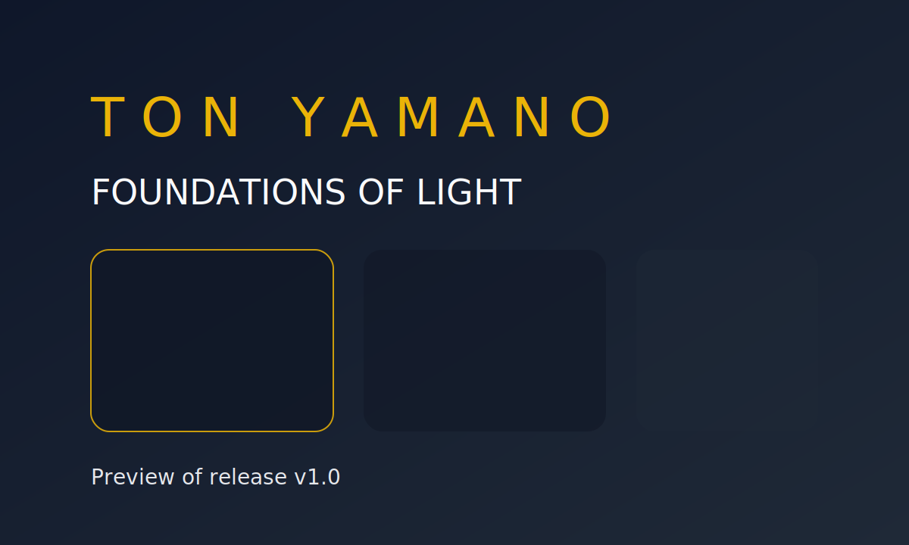
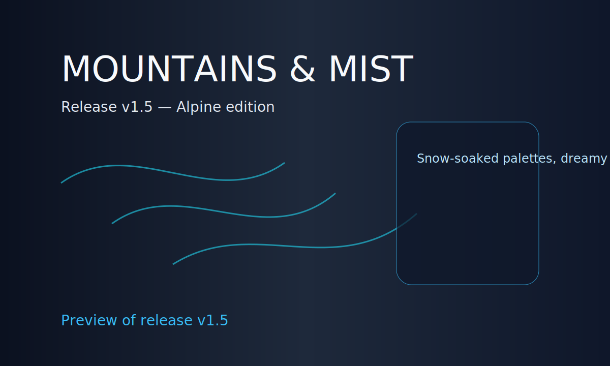
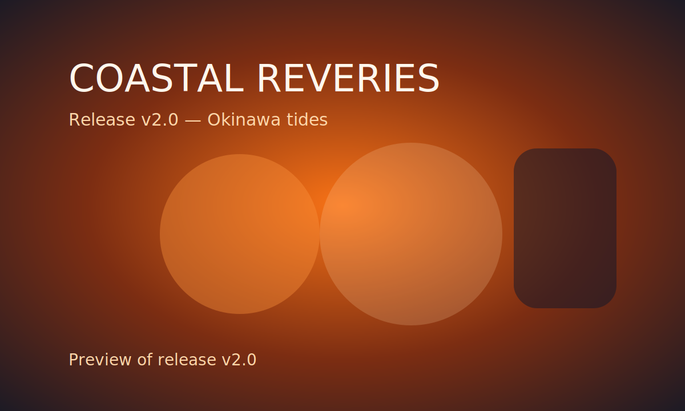

# Ton Yamano Gallery

A Nuxt 3 + TailwindCSS experience for showcasing Ton Yamano's evolving personal photo releases. Explore richly designed release cards, curated highlight frames, and a newsletter prompt for upcoming drops.

## Getting started

```bash
cd TonYamanoGallery
npm install
npm run dev
```

## Project structure

- `pages/` — Application routes.
- `components/` — Reusable UI primitives such as the hero, version cards, and newsletter module.
- `data/gallery.ts` — Structured release metadata including preview website imagery for each version and featured frames.
- `public/` — Static preview artwork and illustrated placeholder frames.

## Preview snapshots

Each release includes a preview visual so visitors can quickly grasp the evolution of the gallery experience.

| Version | Preview |
| ------- | ------- |
| v1.0    |  |
| v1.5    |  |
| v2.0    |  |

These SVG snapshots live in `public/previews` and can be swapped with real exports or screenshots once the design is finalized.
